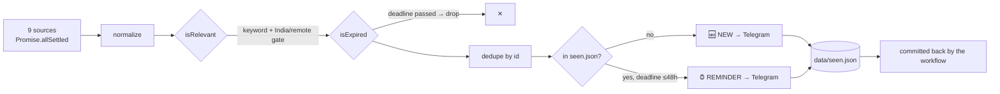

# event-radar

> Hourly hackathon + AI-event radar for India. Polls 9 sources, filters, dedupes, and pushes only the new stuff to Telegram.

[](https://github.com/rithvikshettyy/radar/actions/workflows/radar.yml)


[](LICENSE)

Finding out about a hackathon the day after registration closed is the whole
problem this solves. `event-radar` sweeps every feed that actually lists Indian
and remote AI events, keeps a `seen.json` so nothing is sent twice, and pings you
again 48h before a deadline you already know about.

No server, no database, no paid API. It runs entirely inside a GitHub Actions
cron job on the free tier.

```
🆕 NEW EVENT                              ⏰ DEADLINE SOON — in 9h

Hacker House Goa 2026   ← tappable link   Sarvam Epoch

📍 Goa · 12 spots left                    📍 Bengaluru
⏳ Mon, 10 Aug 2026, 17:23 · in 11 days   ⏳ Fri, 31 Jul 2026, 02:23
🗓 Posted Thu, 30 Jul 2026 (today)        🗓 Posted Sat, 25 Jul 2026 (5 days ago)
🔗 devfolio · hhgoa.devfolio.co           🔗 luma-discover · luma.com
```

---

## Contents

- [Sources](#sources)
- [How it works](#how-it-works)
- [Quick start](#quick-start)
- [Deploy on GitHub Actions](#deploy-on-github-actions)
- [Configuration](#configuration)
- [Message format](#message-format)
- [Project layout](#project-layout)
- [Adding a source](#adding-a-source)
- [Troubleshooting](#troubleshooting)
- [License](#license)

---

## Sources

| Source | Access | What it brings | Key needed |
|---|---|---|---|
| **Devfolio** | public API | India's main hackathon host — Hacker House Goa, most Indian hackathons. Precurated. | no |
| **Luma discover** | public API | Sweeps `ai` + `tech` events around 6 Indian cities incl. Goa. Catches one-off events in no calendar: hacker houses, makeathons, demo days. Surfaces `sold out` / `N spots left`. | no |
| **HackCulture** | public API | India-focused host for corporate/campus hackathons and innovation challenges — Sarvam BuildIn' Hours, GFF fintech sprints, campus hackathons. Precurated, registration-open only. | no |
| **Luma calendars** | ICS | Communities you explicitly subscribe to. | no |
| **Devpost** | JSON | Global hackathons. | no |
| **HackerEarth** | public API | Hackathons + competitive challenges. | no |
| **Sarvam** | public Sanity dataset | Sarvam Epoch, webinars, hackathons straight from the CMS behind `sarvam.ai/events`. Precurated. | no |
| **Basecamp** | public Sanity dataset | `basecampblr.com` — Bengaluru's founder/builder week, ~90 sessions, from the CMS behind the site. `Build`-category sessions are precurated; the rest face the keyword gate. | no |
| **MLH** | scrape | Student hackathon season (current + next). | no |
| **Web search** | Firecrawl / Brave / DDG | Events that live on no structured feed at all — standalone sites, LinkedIn, X. | optional |

Every source runs under `Promise.allSettled`, so one dead feed never kills the run.

## How it works



- **Relevance** — whole-word keyword match (`ai` hits *AI hackathon*, not *Mumbai*),
  minus an exclude list (school events), and India-or-remote only. Precurated
  sources (Luma discover, Devfolio, HackCulture, Sarvam) skip the keyword gate —
  they're already scoped — but still honor the India/remote and exclude filters.
- **Dedupe** — stable hash of the event URL, keyed by source. One event arriving
  twice in a run (Devpost queries two listings, Luma calendars overlap) collapses to
  the copy that actually carries a deadline.
- **State** — `data/seen.json`, committed back by the workflow after each run.
- **Alerts** — once when new, once more when the deadline is inside
  `deadlineReminderHours` (default 48). If an event is *already* inside that window
  when first seen, the reminder is burned immediately so it doesn't re-ping next hour.

## Quick start

Requires Node ≥ 22 (uses global `fetch`).

```bash
git clone https://github.com/rithvikshettyy/radar.git
cd radar
npm install

npm run selftest   # offline logic check — no secrets, no network
npm run dry        # real fetch, prints what it would send
npm start          # real run (dry unless the Telegram env vars are set)
```

| Script | Does |
|---|---|
| `npm start` | Full run. Sends to Telegram if secrets are set, otherwise prints. |
| `npm run dry` | Fetches for real, never sends, **still writes `seen.json`**. |
| `npm run seed` | Records everything as already-seen without notifying. Run once so an existing backlog doesn't arrive as one flood. |
| `npm run selftest` | Offline checks on filtering + message formatting. |
| `npm run chatid` | Prints every chat the bot can see, with its id. How you find a **group** id. |

### Telegram bot

1. Message [`@BotFather`](https://t.me/BotFather) → `/newbot` → copy the **bot token**.
2. Message your new bot anything (say "hi") so it's allowed to DM you.
3. Message [`@userinfobot`](https://t.me/userinfobot) → it replies your numeric **chat id**.

```bash
cp .env.example .env   # then export them, or pass inline:
TELEGRAM_BOT_TOKEN=xxx TELEGRAM_CHAT_ID=yyy npm start
```

| Variable | Required | Purpose |
|---|---|---|
| `TELEGRAM_BOT_TOKEN` | yes (to actually send) | BotFather token |
| `TELEGRAM_CHAT_ID` | yes (to actually send) | One **or more** chat ids, comma separated |
| `BRAVE_API_KEY` | no | Switches web search to Brave |
| `FIRECRAWL_API_KEY` | no | Raises Firecrawl's rate limit — and as of now the keyless tier 403s, so without one of these two keys the search net is off |

Unset token/chat = dry mode: it prints what it *would* send.

### Share it with a group

The same run can feed several chats, so friends get the feed without each running
their own copy. Nothing to deploy twice — just add ids.

1. **Create the group** and add your bot to it.
2. **Send `/start@yourbotname` in the group.** Not optional: Telegram bots have
   *group privacy* on by default, so inside a group the bot only sees messages that
   are commands or that @mention it. Until one arrives, the group is invisible to it.
3. **Read the id:**
   ```bash
   TELEGRAM_BOT_TOKEN=xxx npm run chatid
   ```
   ```
   chat id            type        name
   -----------------  ----------  ----
   123456789          private     You
   -1001234567890     supergroup  Hack Radar
   ```
   Group ids are **negative**. `@userinfobot` only knows your personal id, which is
   why this script exists.
4. **Set both targets** — comma separated, no spaces needed:
   ```bash
   TELEGRAM_CHAT_ID=123456789,-1001234567890
   ```
   On GitHub Actions, edit the `TELEGRAM_CHAT_ID` secret to the same comma list.

| Target form | Meaning |
|---|---|
| `123456789` | a person |
| `-1001234567890` | a group / supergroup |
| `@somechannel` | a public channel by username |
| `-1001234567890:42` | topic `42` inside a forum-enabled group |

A send that fails for one target (bot kicked, wrong id) is logged with that id and
doesn't stop the others.

**Two things worth knowing before you add friends.** The bot only *pushes* — it has
no commands, so nobody in the group can query it or change the filters; tuning stays
in `config.js`, which is yours. And `seen.json` is global, not per-chat: an event is
sent once to every target at the same time, so a friend joining later sees only what
comes next, not the backlog.

## Deploy on GitHub Actions

1. **Push the repo to GitHub.**
2. **Settings → Secrets and variables → Actions** → add `TELEGRAM_BOT_TOKEN` and
   `TELEGRAM_CHAT_ID`.
   > ⚠️ Without these the run is dry — but it *still* records everything into
   > `seen.json`, so the backlog is consumed silently and those events never reach you.
3. **Settings → Actions → General → Workflow permissions → Read and write.**
   New repos default to read-only, which makes the `seen.json` commit fail — and it
   fails *green*, because the push is wrapped in `|| echo`. Symptom: every hourly run
   re-alerts events you already got.
4. **Seed once**, so the existing backlog (~240 events) doesn't land as one flood:
   ```bash
   npm run seed
   git add data/seen.json && git commit -m "seed seen state" && git push
   ```
5. **Actions tab → enable workflows.** Runs hourly (`0 * * * *`); hit **Run workflow**
   once to test.

Two GitHub facts worth knowing, neither worth fighting: scheduled workflows are
disabled after 60 days of repo inactivity, and cron on a busy hour commonly lags
10–20 minutes.

## Configuration

Everything lives in [`config.js`](config.js).

| Key | Default | What it controls |
|---|---|---|
| `include` | AI/ML/hackathon terms | Whole-word keywords an event must match |
| `exclude` | school events, bootcamps, fashion | Kills a match outright |
| `indiaOrRemoteOnly` | `true` | Restrict to India-based or online/remote |
| `indiaOrRemoteHints` | 20+ cities + `online`/`remote`/`virtual` | What counts as India-or-remote |
| `lumaIcsUrls` | `[]` | Luma calendars to watch (see below) |
| `lumaDiscover` | `ai`+`tech` × 6 cities | Categories and city coordinates for the discovery sweep |
| `webSearch.provider` | `auto` | `auto` \| `firecrawl` \| `ddg` \| `brave` \| `off` |
| `searchQueries` | 6 queries | What the web-search net looks for. `{year}`/`{nextYear}` expand at run time |
| `denyHosts` | socials, dev blogs | Extra hosts the search net must never surface |
| `deadlineReminderHours` | `48` | How early the reminder fires |
| `timezone` | `Asia/Kolkata` | IANA zone for dates in messages |

`exclude` matches **whole words**, so plurals need their own entry — `"bootcamp"`
does not match "bootcamps". Both are in the default list, along with `boot camp`,
`masterclass`, `crash course` and `fashion`.

### Luma calendars

Open any Luma calendar page → **Subscribe** → "Add to Calendar" gives an ICS link
like `https://api.lu.ma/ics/get?entity=cal-XXXX`. Paste it into `config.lumaIcsUrls`.
Bangalore/Mumbai tech + AI community calendars are the high-yield ones.

### Devfolio — zero setup

Nothing to configure. It POSTs to `api.devfolio.co/api/search/hackathons`, the same
public keyless endpoint the site's own list page calls, over the `application_open`
and `upcoming` buckets. The deadline shown is `reg_ends_at` (last day to apply).

### Web-search net

For events announced only on a standalone site / LinkedIn / X. Works with no key —
`config.webSearch.provider` picks how:

| value | behaviour |
|---|---|
| `auto` *(default)* | Brave if `BRAVE_API_KEY` is set, else Firecrawl |
| `firecrawl` | force `api.firecrawl.dev/v2/search` — JSON, answers with no key |
| `ddg` | force the keyless `html.duckduckgo.com` scrape |
| `brave` | force Brave; logs and skips if the key is missing |
| `off` | no web search |

**Why Firecrawl is the keyless default.** It answers from a GitHub Actions runner,
which the DDG scrape mostly doesn't — DuckDuckGo throttles shared CI egress IPs, so
those runs returned `ddg fail: blocked (anomaly page)` and zero hits. Firecrawl
returns clean JSON and fails as a 429 rather than an HTML block page.

**Don't set `FIRECRAWL_API_KEY` on a whim.** Firecrawl bills search at 2 credits per
10 results, and the free tier is 1,000 credits/month — about 500 searches. An hourly
cron running 5 queries needs ~3,600/month, so a keyed free account runs dry in under a
week and then 402s. The keyless tier has no such budget. (Brave's free tier is
2,000 queries/month, also short of 3,600 — if you set `BRAVE_API_KEY`, either accept
that it stops partway through the month or trim `searchQueries`.)

The keyless tier is documented for Firecrawl's own MCP/CLI/SDK clients; a plain
`fetch` works today but sits outside that contract, so treat it as best-effort —
`ddg` is still there as a fallback. Either way search is a bonus net; Devfolio,
HackCulture and Luma are what you actually rely on.

Search hits aren't precurated, so they face the full keyword + India/remote gate, plus
a denylist that drops listicle/aggregator domains (reskilll, internshala, YouTube,
Reddit …), press-release wires (PR Newswire, Business Wire, GlobeNewswire), social
posts (x.com, twitter.com, Threads, Bluesky) and developer-blog platforms (dev.to,
Hashnode, Substack, Medium). The built-in list lives in `websearch.js`; add your own
in `config.denyHosts` without touching source.

Matching is on the **hostname**, subdomains included — not a substring of the URL.
That distinction is load-bearing the moment a short entry like `x.com` is added: a
substring check would also blackhole `phoenix.com` and `matrix.com`. An entry can
carry a path to scope it, e.g. `devpost.com/c/` denies category pages only.

Queries use `{year}` / `{nextYear}` rather than a literal year. Hard-coding `2026`
rots quietly: come January the radar keeps asking for last year's events, then alerts
you to pages about hackathons that already finished.

**The article gate.** Most of what a search engine returns for these queries is
*coverage* of an event, not the event: a press release, a news story, a "top 10
hackathons in Bengaluru" roundup. Those are the worst noise here because they carry no
deadline, so `isExpired()` can never retire them — they sit in `seen.json` forever.
Host denylisting alone is whack-a-mole (every run surfaces a new outlet), so
`looksLikeArticle()` matches on shape instead:

| Signal | Example |
|---|---|
| editorial URL path | `/news/`, `/news-releases/`, `/newsroom/`, `/blog/`, `/story/`, `/2026/08/` |
| press-release verb in the headline | *KnowBe4 **extends** agent security to…*, *Anthropic **says**…* |
| roundup framing | *Top 10…*, *Events and Hackathons in Bangalore (April-May 2026)* |
| write-up of a finished event | *…**Recap***, ***Winners announced** for…*, *Sarvam Epoch **concludes***, ***How we built***… |
| the window is shut | *Registrations **are now closed***, ***sold out***, ***deadline passed*** — read from the snippet too, not just the title |

A bare year segment (`hackindia.org/2026/…`) is deliberately *not* an archive path —
real event sites organize by edition year. Nor is a bare *winners* or *prizes* a recap
signal — live event pages advertise prize pools. Every rule is pinned in
`selftest.js` against hits that actually reached the chat.

**Finished events, and why they used to arrive weeks late.** `isExpired()` only ever
looked at the `deadline` field — and a web-search hit has none, so *nothing could
retire one*. A page about a hackathon that ended in May still landed as a `🆕 NEW
EVENT` in August. When there's no usable deadline, the dates are now read out of the
event's own title/description instead, and the latest one is treated as its end:

| Text | Read as |
|---|---|
| `12 Aug 2026`, `Aug 12, 2026`, `2026-08-12` | end of 12 Aug 2026 |
| `August 2026` | end of Aug 2026 |
| `AI Hackathon 2025` | end of 2025 → **expired** |
| *(no date named)* | unknown → kept, there's nothing to check |

Tiered by precision, most precise wins. Mixing tiers is worse than either: a page
reading *"12 Aug 2026 … © 2026"* would inherit end-of-December from the stray year
and sit in the feed four months after the event. Two details that bit in practice —
the month pattern is an explicit alternation, because a loose one reads *"Marathon
2026"* as March 2026 and expires live events five months early; and a year must stand
alone, or the tweet id in `x.com/…/status/2084578727158317435` reads as the year 2084
and keeps a months-old post alive forever.

The scan deliberately ignores `tags`, which for a search hit is the query string —
reading it would stamp the current year onto every hit and make the check pass
unconditionally. Structured sources are unaffected: every one of them supplies a real
deadline, so the text scan never judges them. Each run logs `expired=N`.

**`"global"` is not an India/remote hint.** It was, and it's the one hint that names
neither a place nor a delivery mode, so press-release boilerplate ("the *global*
leader in…") walked a Dubai product launch through an India-only gate. A genuinely
global online hackathon still passes on `online`/`remote`/`virtual`.

## Message format

The title carries the link — Telegram still builds its preview from it — so there's no
raw URL line; the footer shows source + destination host instead. Any missing field
drops its own line, and an unparseable date is printed raw rather than as
`Invalid Date`.

**On the posted date.** Almost no feed exposes a publish timestamp (checked: Devfolio,
Devpost, HackerEarth, Luma discover — none). Sarvam's CMS gives `_createdAt` and Luma
ICS gives `CREATED`; those are used directly. Everything else falls back to
`firstSeen` — the run that first spotted the event — recorded per event in `seen.json`,
so a later deadline reminder shows the same date. Entries that predate this (and
anything recorded with `--seed`) have no `firstSeen`, so they omit the line rather than
claim they were posted today.

Dates render in `config.timezone`. Actions runners are UTC, which would otherwise push
a 9pm IST event onto the previous day.

**Source colours.** Each message opens with a coloured square keyed to its source —
🟠 Basecamp, 🔵 Devfolio, 🟣 Luma (both the calendar and discovery sweeps), ⚪ everything
else. Edit `config.sourceColors`; the key is the source name the fetcher passes to
`normalize()`, and anything unlisted takes `default`.

Telegram gives bots no way to colour *text*: HTML mode allows only
`b/i/u/s/code/pre/a/blockquote`, and `<tg-emoji>` (real coloured custom emoji) is
limited to bots that bought a username on Fragment. A coloured square is the only
colour that renders on every client, for free — hence the square rather than styled
text.

## Project layout

```
.
├── config.js               # every knob worth turning
├── data/seen.json          # dedupe state, committed back each run
├── .github/workflows/
│   └── radar.yml           # hourly cron + seen.json commit
└── src/
    ├── radar.js            # entry point: fetch → filter → dedupe → notify
    ├── filter.js           # id hashing, normalize(), relevance, expiry, reminders
    ├── telegram.js         # HTML message formatting + multi-chat sendMessage
    ├── chatid.js           # prints chat ids — how you find a group's
    ├── selftest.js         # offline checks
    └── sources/
        ├── basecamp.js  devfolio.js  devpost.js
        ├── hackculture.js  hackerearth.js  mlh.js  sarvam.js
        └── luma.js  luma-discover.js  websearch.js
```

## Adding a source

Drop `src/sources/foo.js` exporting an `async function fetchFoo()` that returns

```js
normalize({ title, url, deadline, location, description, posted }, "foo")[]
```

Set `posted` only if the feed genuinely has a publish date — otherwise leave it off
and `firstSeen` covers it. Pass `{ precurated: true }` as the third argument if the
feed is already scoped and shouldn't face the keyword gate. Then wire the call into
the `Promise.allSettled([...])` array in [`src/radar.js`](src/radar.js). A failing
source never kills the run.

## Troubleshooting

| Symptom | Cause |
|---|---|
| Every hourly run re-sends the same events | Workflow permissions are read-only, so the `seen.json` commit silently fails. Fix in Settings → Actions → General. |
| Workflow is green but nothing arrives in Telegram | Secrets missing → dry mode. It logged `[dry] would send:` and consumed the backlog into `seen.json`. |
| `devfolio fail: <type> <status>` in the logs | Endpoint changed. Re-derive the call from `devfolio.co/hackathons/open` → DevTools → Network. |
| `hackculture fail: 401` | The endpoint moved to the login-only `/hackathons/all` variant. The keyless one is `GET api.hackculture.io/api/v1/hackathons?skip=&limit=` (limit ≤ 50), what `/programs` itself calls. |
| `ddg fail: blocked (anomaly page)`, zero web hits | Expected on CI IPs — that's why `auto` uses Firecrawl instead. Only reachable now via `provider: "ddg"`. |
| `firecrawl fail: 402` | A `FIRECRAWL_API_KEY` is set and its credits are gone. Unset it — the keyless tier has no credit budget. |
| `firecrawl fail: 429` | Keyless rate limit. The sweep stops at the first block rather than hammering; next hourly run retries. |
| `firecrawl fail: 403 (keyless access refused)` | Firecrawl has closed the keyless tier this fetch relied on. With DDG also blocked on CI, the search net is off until you set `BRAVE_API_KEY` (2k queries/mo free) or `FIRECRAWL_API_KEY`. Set `webSearch.provider: "off"` to stop trying. The structured sources are unaffected. |
| A group gets nothing while your DM works | The bot isn't in the group, or was added but never spoken to — send `/start@yourbot` there, re-run `npm run chatid`, and check the id is the negative one. Per-target failures log as `telegram fail [<id>]`. |
| `npm run chatid` prints no chats | Group privacy: bots only see commands or @mentions in a group. Send `/start@yourbot`. Also note `getUpdates` consumes what it returns, so a second run right after can legitimately show nothing. |
| A source goes quiet | Devpost/MLH markup can change shape. Parsing is defensive, so it fails to zero results rather than crashing — check the run log's per-source counts. |
| Scheduled runs stopped entirely | GitHub disables cron after 60 days of repo inactivity. Re-enable in the Actions tab. |

## Notes

- Company pages without feeds (Anthropic, OpenAI) aren't polled — add them as scrape
  sources, or watch their Luma calendars, where they usually post anyway.
- Want email too? Add `src/email.js` (Resend free tier) alongside `telegram.js` and
  call it in the deliver path.

## License

[MIT](LICENSE) © Rithvik Shetty
